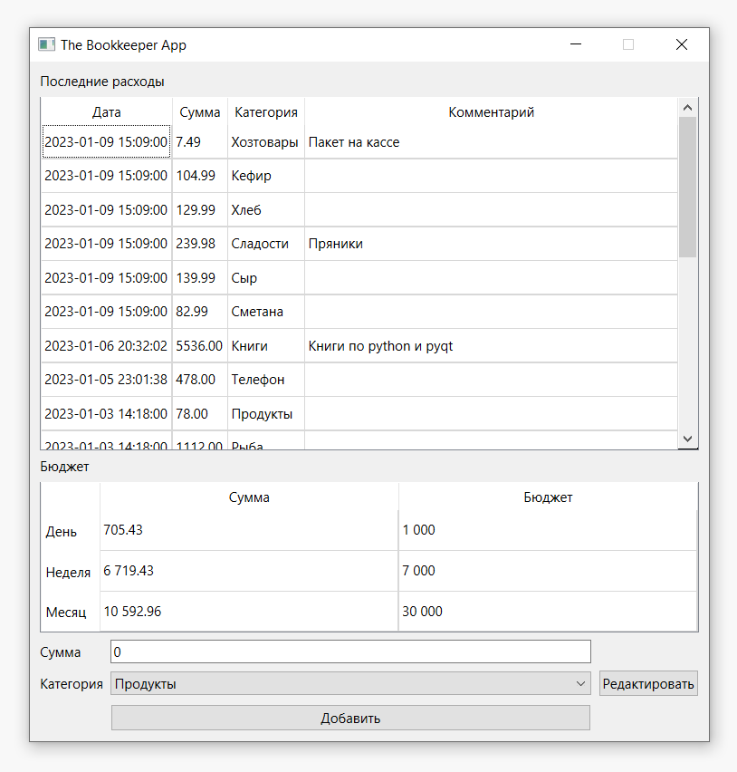

# Простая программа для управления личными финансами
#### (учебный проект для курса по практике программирования на Python)


Запуск программы осуществляется из файла bookkeeper.presenter.py. Он же и является синхронизатором
баз данных и интерфейса приложения.

Данные о категориях и расходах хранятся в базах данных categories.db и expenses.db соответственно.

Базы данных не удаляются при закрытии окна. Поэтому перед повторным запуском приложения нужно удалить их вручную

В файле bookkeeper.view.Redactclass.py содержится описание основного интерфейса приложения. 

В файле bookkeeper.view.redactmenu.py содержатся описания диалоговых окон для редактирования списка категорий
и добавления расходов.


[Техническое задание](specification.md)

Архитектура проекта строится на принципе инверсии зависимостей. Упрощенная схема
классов выглядит так:


Для хранения данных используется паттерн Репозиторий. Структура файлов
и каталогов (модулей и пакетов) отражает архитектуру:

📁 bookkeeper - исполняемый код 

- 📁 models - модели данных

    - 📄 budget.py - бюджет
    - 📄 category.py - категория расходов
    - 📄 expense.py - расходная операция
- 📁 repository - репозиторий для хранения данных

    - 📄 abstract_repository.py - описание интерфейса
    - 📄 memory_repository.py - репозиторий для хранения в оперативной памяти
    - 📄 sqlite_repository.py - репозиторий для хранения в sqlite (пока не написан)
- 📁 view - графический интерфейс (пока не написан)
- 📄 simple_client.py - простая консольная утилита, позволяющая посмотреть на работу программы в действии
- 📄 utils.py - вспомогательные функции

📁 tests - тесты (структура каталога дублирует структуру bookkeeper)

Для работы с проектом нужно сделать fork и склонировать его себе на компьютер.

Проект создан с помощью poetry. Убедитесь, что poetry у вас установлена
(инструкцию по установке можно посмотреть [здесь](https://python-poetry.org/docs/)).
Для установки всех зависимостей, запустите (убедитесь, что вы находитесь
в корневой папке проекта - там, где лежит файл pyproject.toml):

```commandline
poetry install
```

Для запуска тестов и статических анализаторов используйте следующие команды (убедитесь, 
что вы находитесь в корневой папке проекта):
```commandline
poetry run pytest --cov
poetry run mypy --strict bookkeeper
poetry run pylint bookkeeper
poetry run flake8 bookkeeper
```

При проверке работы будут использоваться эти же инструменты с теми же настройками.

Задача первого этапа:
1. Сделать fork репозитория и склонировать его себе на компьютер
2. Написать класс SqliteRepository
3. Написать тесты к этому классу
4. Подключить СУБД sqlite к simple_client (пока он работает в оперативной памяти и все забывает при выходе)

Для сдачи работы достаточно прислать ссылку на свой форк, pull-request создавать 
не надо.

Задача второго этапа:
1. Создать виджеты:
   - для отображения списка расходов с возможностью редактирования
   - для отображения бюджета на день/неделю/месяц с возможностью редактирования
   - для добавления нового расхода
   - для просмотра и редактирования списка категорий
2. Собрать виджеты в главное окно

В итоге окно должно выглядеть примерно так:

Воспроизводить данный дизайн в точности не требуется, вы можете использовать другие
виджеты, другую раскладку. Дизайн, представленный на скриншоте, предполагает, что 
редактирование списка категорий будет выполняться в отдельном окне. Вы можете
сделать так же, а можете все разместить в одном окне, использовать вкладки
или контекстные меню. Важно только реализовать функциональность.

Задачей этого этапа не является подключение реальной логики приложения и базы
данных. Пока нужно только собрать интерфейс. Файлы, описывающие интерфейс,
должны располагаться в папке bookkeeper/view.
